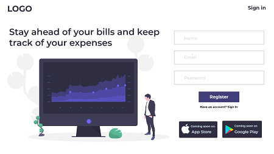
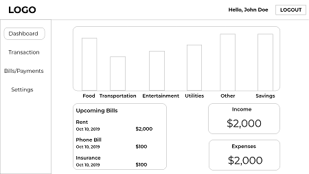
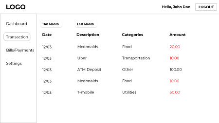

# Personal Finance App
A full stack Mern App that tracks all your transaction from your bank account

## Problem

People don't manage their money well and their finances starts getting out of control which might eventually leads alots of debt.

## Overview

* Users can creates profiles with encrypted passwords.

* Users can add account via plaid api which decreases the time of manually writing out transactions.

* Users can view account transactions and balances.

* Users gets notification of an upcoming bill.

## Technology Used

* MongoDB for darabase

* Express & Node for backend

* React for front end

* Redux for state management

* Chartjs for dashboard ui

* Bootstrap

## Api

 * Plaid